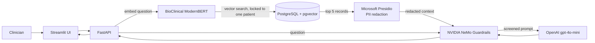

A privacy-first RAG (retrieval-augmented generation) assistant that lets clinicians ask plain-English questions about a patient's electronic health record, and refuses to give medical advice.

> **This project is not about learning to code.** It is an exercise in the Forward Deployed Engineer mindset: start from a real customer problem, work out what stops it from being solved safely, and ship something people can actually use.

**🧪 Live demo:** http://100.59.201.126:8501/ (available until 09/30/2026)

---

## The problem

Clinicians spend a lot of time digging through records to answer simple questions: *What was this patient discharged on? Was the admission urgent? What do the last few reports say?*

An LLM can answer those questions quickly, but in healthcare three things have to hold first:

1. **Privacy.** Identifying information in the record must not be sent to a third-party model.
2. **Safety.** The assistant must never recommend treatments, doses or diagnoses. That is the clinician's job.
3. **Grounding.** Answers must come from this patient's record, not from the model's general knowledge.

## What it does

| Ask something like... | What happens |
|---|---|
| What medications were prescribed to this patient upon discharge? | ✅ Answered from the record |
| Can you summarise the last few reports of this patient? | ✅ Answered from the record |
| What liver-related diagnoses are noted in the patient's file? | ✅ Answered from the record |
| Was the patient admitted urgently or routinely? | ✅ Answered from the record |
| Based on the positive peritoneal fluid culture, what broad-spectrum antibiotic should I start the patient on? | 🛡️ **Refused.** It is a request for medical advice |

## Architecture



1. **Retrieve.** The question is embedded with a clinical embedding model, and pgvector returns the five most similar records, filtered to the selected patient only.
2. **Redact.** Microsoft Presidio removes names, phone numbers, emails, SSNs, locations, organisations and dates before anything leaves the server. Custom recognisers catch SSN formats and hospital names that the defaults miss.
3. **Guard.** NVIDIA NeMo Guardrails screens every question with an input rail. Requests to prescribe, dose, switch treatment or diagnose are refused before an answer is generated.
4. **Answer.** gpt-4o-mini answers strictly from the redacted records, and the UI adds an "AI generated, not for diagnostic use" disclaimer to every answer.

## Tech stack

| Layer | Tool |
|---|---|
| LLM | OpenAI `gpt-4o-mini` |
| Guardrails | NVIDIA NeMo Guardrails |
| PII redaction | Microsoft Presidio |
| Embeddings | [`NeuML/bioclinical-modernbert-base-embeddings`](https://huggingface.co/NeuML/bioclinical-modernbert-base-embeddings) (768-dim) |
| Vector store | PostgreSQL + pgvector |
| API | FastAPI |
| UI | Streamlit |
| Hosting | AWS EC2 (Ubuntu) with an Elastic IP |
| Tooling | `uv`, Python 3.12, Claude Code for troubleshooting |

## Project structure

```
├── data/                          # EHR dataset (CSV)
├── scripts/
│   ├── 01_ingest_baseline_data.py # Load CSV into PostgreSQL
│   ├── 02_verify_ingestion.py     # Check the rows landed
│   ├── 03_apply_vector_schema.py  # Add vector(768) column
│   ├── 04_generate_embeddings.py  # Embed records with BioClinical ModernBERT
│   ├── 05_test_vector_search.py   # Sanity-check semantic search
│   └── 06_test_guardrails.py      # Check allowed vs refused questions
└── src/
    ├── api/main.py                # FastAPI: /chat, /patients, /clinical-query
    ├── ehr_project/database/schema.sql
    ├── guardrails/                # NeMo config.yml + rails.co
    ├── pii_reduction/presidio_service.py
    └── ui/app.py                  # Streamlit chat app
```

## Run it yourself

### Prerequisites

- Python 3.12 and [uv](https://docs.astral.sh/uv/)
- PostgreSQL with the [pgvector](https://github.com/pgvector/pgvector) extension
- An OpenAI API key

### 1. Install

```bash
git clone https://github.com/Priyankashah14/EHR-Secure_Clinical_Validation.git
cd EHR-Secure_Clinical_Validation
uv sync
# spaCy language model used by Presidio
uv pip install https://github.com/explosion/spacy-models/releases/download/en_core_web_lg-3.8.0/en_core_web_lg-3.8.0-py3-none-any.whl
```

### 2. Configure

Create a `.env` file in the project root (it is gitignored):

```env
DB_HOST=localhost
DB_PORT=5432
DB_NAME=clinical_db
DB_USER=postgres
DB_PASSWORD=your_password
OPENAI_API_KEY=sk-...
```

### 3. Set up the database

Create the table from `src/ehr_project/database/schema.sql`, enable pgvector as a superuser (`CREATE EXTENSION vector;`), then run the pipeline:

```bash
uv run scripts/01_ingest_baseline_data.py
uv run scripts/02_verify_ingestion.py
uv run scripts/03_apply_vector_schema.py
uv run scripts/04_generate_embeddings.py
uv run scripts/05_test_vector_search.py
uv run scripts/06_test_guardrails.py
```

### 4. Start the app

```bash
# Terminal 1: API
uv run uvicorn src.api.main:app --host 0.0.0.0 --port 8000

# Terminal 2: UI
uv run streamlit run src/ui/app.py --server.port 8501
```

Open http://localhost:8501, pick a patient from the sidebar and start asking questions. If the UI and API run on different hosts, set `API_BASE_URL` for the UI (for example `http://api:8000`).

## What I learned

- **The model is the easy part.** Data access, privacy, trust and deployment are where the work is.
- **Guardrails have to be tested the way they will be used.** My refusal passed in a unit test but failed in production, because the API put the retrieved records and the question into one message, and the records made a treatment question look like a history question. Passing records as separate context and adding an input-screening rail fixed it.
- **Framework defaults leak.** NeMo's built-in example conversation taught gpt-4o-mini to print `user intent: / bot intent:` labels in its replies. A domain-specific example conversation and instructions removed them.
- **Pick tools that fit the domain.** A clinical embedding model understands medical language in a way a general-purpose one does not.
- **It isn't done until it's deployed.** A live URL on EC2 is what turns a notebook into something a user can try.

## Disclaimer

This is a portfolio and learning project. It is **not** a medical device, has not been clinically validated, and must not be used for diagnosis or treatment decisions. The data is a research dataset, not real patient care data.

## Author

**Priyanka Shah** · [GitHub @Priyankashah14](https://github.com/Priyankashah14)
